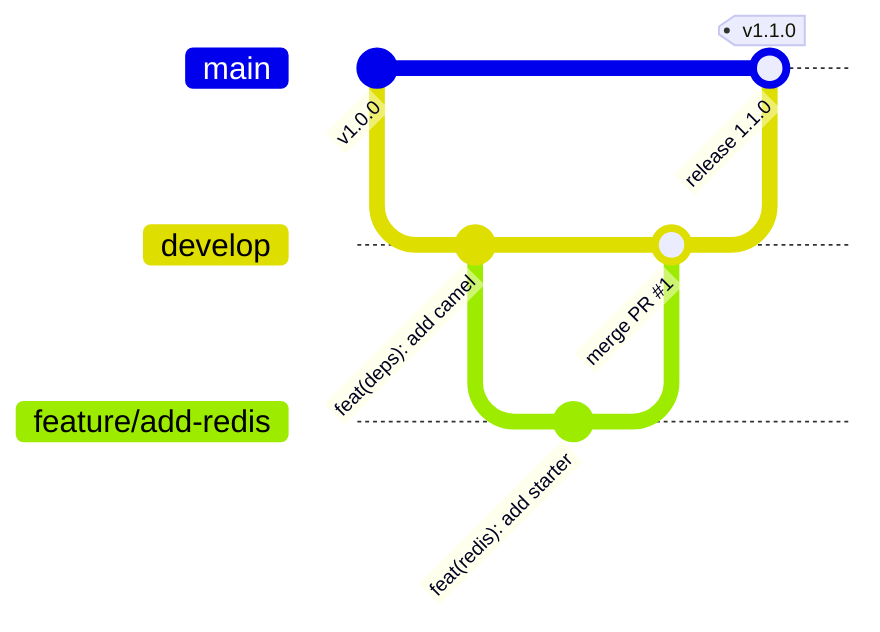

# Development Guidelines and Contribution Standards

This document defines the engineering standards, architecture principles, dependency management policies, and contribution workflows required when maintaining or contributing to `abstract-nnp`.

---

## Table of Contents

1. [Architecture and Design Philosophy](#1-architecture-and-design-philosophy)
2. [Technology Stack and Compatibility Matrix](#2-technology-stack-and-compatibility-matrix)
3. [Dependency Management Policies](#3-dependency-management-policies)
   - [Spring Ecosystem Alignment](#spring-ecosystem-alignment)
   - [Jakarta EE Standard (Spring Boot 3.x / Java 21)](#jakarta-ee-standard-spring-boot-3x--java-21)
   - [Security and Vulnerability Management (CVE Policy)](#security-and-vulnerability-management-cve-policy)
4. [Workflow for Modifying Dependencies](#4-workflow-for-modifying-dependencies)
   - [Adding a New Dependency](#adding-a-new-dependency)
   - [Upgrading an Existing Dependency](#upgrading-an-existing-dependency)
   - [Deprecating or Removing a Dependency](#deprecating-or-removing-a-dependency)
5. [Code Quality and Formatting Standards](#5-code-quality-and-formatting-standards)
6. [Git Workflow and Branching Strategy](#6-git-workflow-and-branching-strategy)
   - [Branch Naming Conventions](#branch-naming-conventions)
   - [Commit Message Format (Conventional Commits)](#commit-message-format-conventional-commits)
7. [Pull Request (PR) and Review Checklist](#7-pull-request-pr-and-review-checklist)
8. [Release Lifecycle and Versioning](#8-release-lifecycle-and-versioning)

---

## 1. Architecture and Design Philosophy

`abstract-nnp` serves as the centralized parent and Bill of Materials (BOM) for all microservices in the platform. Its primary responsibilities are:

1. **Deterministic Builds**: Eliminate version drift and conflicting classpath versions across enterprise microservices.
2. **Security by Default**: Proactively address Known Vulnerabilities (CVEs) by enforcing vetted versions at the parent level.
3. **Single Source of Truth**: Centralize plugin configurations (compiler, source, javadoc, enforcer, GPG signing) so child services require minimal build boilerplate.
4. **Non-Intrusive Defaults**: Define dependencies inside `<dependencyManagement>` so child services only pull in what they explicitly require.

---

## 2. Technology Stack and Compatibility Matrix

| Component | Target Version | Description / Role |
| :--- | :--- | :--- |
| **Java JDK** | `21` (LTS) | Baseline runtime target (Virtual Threads, Records, Pattern Matching) |
| **Spring Boot** | `3.5.4` | Core microservice framework parent |
| **Spring Cloud** | `2025.0.0` | Cloud-native microservice orchestration and configuration |
| **Apache Camel** | `4.12.0` | Enterprise Integration Patterns (EIP) and routing |
| **PostgreSQL Driver** | `42.7.7` | Production-grade relational database driver |
| **Hypersistence Utils** | `3.9.4` | Advanced Hibernate 6.x types and JSONB mappings |
| **SpringDoc OpenAPI** | `2.8.9` | OpenAPI 3.0 documentation for Spring Boot 3 |
| **Hazelcast** | `5.5.0` | Distributed in-memory data grid and caching |
| **ModelMapper** | `3.2.4` | Object-to-Object transformation library |
| **Eclipse JGit** | `7.3.0` | In-memory Git repository operations |
| **JavaPoet / JSONSchema2Pojo** | `1.13.0` / `1.2.2` | Dynamic code generation and schema tooling |

---

## 3. Dependency Management Policies

### Spring Ecosystem Alignment
- Whenever Spring Boot or Spring Cloud versions are upgraded, verify that transitive dependencies (e.g., Jackson, Netty, Hibernate, Tomcat) align with the official Spring Boot release train.
- Avoid pinning sub-dependencies if Spring Boot's BOM already manages them cleanly, unless an explicit CVE fix is required.

### Jakarta EE Standard (Spring Boot 3.x / Java 21)
- **Zero `javax.*` namespace dependencies**: All dependencies must be compatible with Jakarta EE 10 (`jakarta.*` namespace).
- Use `springdoc-openapi-starter-webmvc-ui` for OpenAPI 3.0 documentation.
- Use `hypersistence-utils-hibernate-62` instead of legacy hibernate types.

### Security and Vulnerability Management (CVE Policy)
- **Zero Critical/High CVE Mandate**: Any dependency with a known High or Critical CVSS score must be patched immediately.
- If a transitive dependency contains a CVE, override it explicitly in `<dependencyManagement>` with a clear explanatory comment.

---

## 4. Workflow for Modifying Dependencies

### Adding a New Dependency

1. **Check Existing BOMs**: Ensure the dependency is not already managed by `spring-boot-starter-parent` or `spring-cloud-dependencies`.
2. **Define the Property**: Add a semantic property under `<properties>` in `pom.xml`:
   ```xml
   <example-lib.version>1.2.3</example-lib.version>
   ```
3. **Add to `<dependencyManagement>`**:
   ```xml
   <dependency>
       <groupId>com.example</groupId>
       <artifactId>example-lib</artifactId>
       <version>${example-lib.version}</version>
   </dependency>
   ```
4. **Do not declare direct `<dependencies>` in the root POM** unless it is a globally required Maven plugin or build extension.

---

### Upgrading an Existing Dependency

1. Locate the version property in `<properties>`.
2. Upgrade the version string.
3. Test compatibility by validating the POM:
   ```bash
   mvn validate
   ```
4. Update the changelog and release notes.

---

### Deprecating or Removing a Dependency

1. Mark the dependency with a deprecation comment in `pom.xml`.
2. Notify downstream consumer teams in release notes.
3. Remove in the next `MAJOR` version bump according to SemVer.

---

## 5. Code Quality and Formatting Standards

- **XML Indentation**: 4 spaces or 1 tab (consistent throughout `pom.xml`).
- **Grouping**: Keep dependencies logically grouped (Core, Persistence, API Docs, Security, Utilities, CodeGen).
- **Comments**: Document the rationale behind version overrides or exclusions.
- **Java Formatting**: Use Google Java Format standards for any companion tooling or code generation templates.

---

## 6. Git Workflow and Branching Strategy



### Branch Naming Conventions

- `feature/<short-description>`: New dependencies or capabilities (e.g., `feature/add-redis-starter`)
- `fix/<issue-description>`: Bug fixes or compatibility adjustments (e.g., `fix/hibernate-type-mapping`)
- `sec/<cve-identifier>`: Security vulnerability patches (e.g., `sec/cve-2024-xyz-snakeyaml`)
- `chore/<task>`: Build tooling, CI/CD, or documentation updates (e.g., `chore/update-readme`)

### Commit Message Format (Conventional Commits)

Format: `<type>(<scope>): <subject>`

Examples:
- `feat(deps): add hazelcast 5.5.0 to dependency management`
- `fix(security): upgrade snakeyaml to 2.4 to resolve CVE-2022-1471`
- `docs(readme): add open-source user guide and deployment documentation`
- `chore(pom): bump spring boot parent to 3.5.4`

---

## 7. Pull Request (PR) and Review Checklist

Before submitting a Pull Request for review:

- [ ] **POM Validation**: `mvn validate` passes without errors.
- [ ] **Property Consistency**: Version is declared as a `<property>` and referenced in `<dependencyManagement>`.
- [ ] **No Direct `<dependencies>`**: Root POM contains only `<dependencyManagement>`.
- [ ] **License Compatibility**: New dependencies use permissive open-source licenses (Apache 2.0, MIT, BSD). Copyleft licenses (GPL, AGPL) are prohibited.
- [ ] **Documentation Updated**: If new libraries are added, update `README.md` and `USER_MANUAL_AND_DEPLOYMENT_GUIDE.md`.
- [ ] **Commit Messages**: Follow Conventional Commits convention.

---

## 8. Release Lifecycle and Versioning

### Releasing a New Version

1. Ensure all pull requests are merged into `main`.
2. Update the `<version>` in `pom.xml` (e.g., `1.0.0` -> `1.1.0`).
3. Commit and create a Git Tag:
   ```bash
   git tag -a v1.1.0 -m "Release version 1.1.0"
   git push origin v1.1.0
   ```
4. The CI/CD pipeline will automatically publish the artifacts to GitHub Packages / Maven Central.

---

*For inquiries or governance topics, contact **contribution@nubons.com**.*
