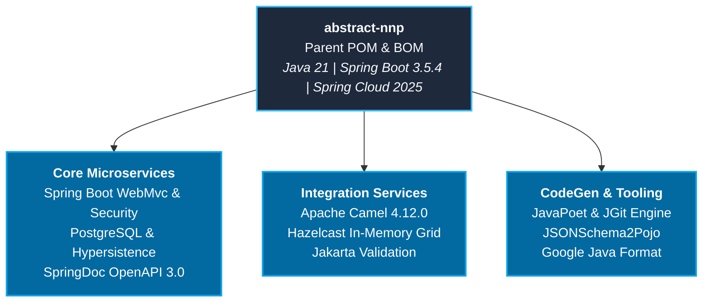

# Abstract NNP Platform (`abstract-nnp`)

[](https://openjdk.org/projects/jdk/21/)
[](https://spring.io/projects/spring-boot)
[](https://spring.io/projects/spring-cloud)
[](https://camel.apache.org/)
[](LICENSE)
[]()

Enterprise Parent POM and Bill of Materials (BOM) establishing standard dependency governance, runtime baselines, and build configurations for Java 21 and Spring Boot 3.5+ cloud-native microservices across the Nubo Native Platform (NNP).

---

## Table of Contents

- [Overview](#overview)
- [Key Architectural Features](#key-architectural-features)
- [Architecture and Ecosystem](#architecture-and-ecosystem)
- [Technology Matrix](#technology-matrix)
- [Quick Start](#quick-start)
  - [Option A: Parent Inheritance (Recommended)](#option-a-parent-inheritance-recommended)
  - [Option B: BOM Import](#option-b-bom-import)
- [Project Documentation](#project-documentation)
- [Local Build and Installation](#local-build-and-installation)
- [Repository Structure](#repository-structure)
- [Security and Vulnerability Management](#security-and-vulnerability-management)
- [Contributing](#contributing)
- [License](#license)

---

## Overview

The `abstract-nnp` platform artifact provides a centralized foundation for microservice development across the NNP ecosystem. It eliminates dependency version drift, classpath conflicts, and repetitive Maven configuration across enterprise services.

Key advantages include:
- **Pre-validated Compatibility**: Every managed library is verified against Spring Boot 3.5.4, Spring Cloud 2025.0.0, and Java 21 LTS.
- **Jakarta EE 10 Alignment**: Enforces modern Jakarta namespace standards across all persistence, validation, and REST layers.
- **Centrally Governed Security**: Proactive vulnerability remediation (CVE patching) at the parent level without requiring downstream code changes.
- **Streamlined POMs**: Downstream microservices declare dependencies without specifying explicit version numbers.

---

## Key Architectural Features

- **Modern Java Baseline**: Pre-configured for Java 21 (LTS) with modern bytecode target, source level, and release parameters.
- **Spring Ecosystem Integration**: Full integration with Spring Boot 3.5.4 and Spring Cloud 2025.0.0 release train.
- **Enterprise Integration Patterns**: Apache Camel 4.12.0 BOM integration for distributed routing, connectors, and mediation.
- **OpenAPI 3.0 Documentation**: Native SpringDoc OpenAPI UI (`springdoc-openapi-starter-webmvc-ui` 2.8.9) support.
- **Data Persistence**: PostgreSQL 42.7.7 driver coupled with Hypersistence Utils 3.9.4 for advanced Hibernate 6.x and JSONB support.
- **Distributed In-Memory Grid**: Hazelcast 5.5.0 dependency management.
- **AST and Code Generation**: JavaPoet, JSONSchema2Pojo, Google Java Format, and Eclipse JGit integration.
- **Multi-Registry Distribution**: Configured profiles for GitHub Packages, Sonatype OSSRH (Maven Central), and GitLab Maven Registry.

---

## Architecture and Ecosystem



---

## Technology Matrix

| Category | Component / Library | Version | Role / Description |
| :--- | :--- | :--- | :--- |
| **Runtime** | Java JDK | `21` | Long-Term Support (LTS) Java runtime |
| **Framework** | `spring-boot-starter-parent` | `3.5.4` | Enterprise microservice application framework |
| **Cloud** | `spring-cloud-dependencies` | `2025.0.0` | Service discovery, configuration, and routing |
| **Integration**| `camel-spring-boot-bom` | `4.12.0` | Enterprise Integration Patterns and connectors |
| **Persistence**| `postgresql` | `42.7.7` | Production relational database driver |
| **ORM Utilities**| `hypersistence-utils-hibernate-62` | `3.9.4` | Hibernate 6.x custom types and JSONB mappings |
| **API Docs** | `springdoc-openapi-starter-webmvc-ui` | `2.8.9` | OpenAPI 3.0 interactive documentation |
| **Caching** | `hazelcast` | `5.5.0` | Distributed in-memory caching and compute |
| **Security** | `java-jwt` / `fusionauth-java-client` | `4.5.0` / `1.30.1` | JWT signing, verification, and auth client |
| **Validation** | `jakarta.validation-api` | `3.1.1` | Jakarta Bean Validation standard |
| **Utilities** | `commons-lang3`, `commons-text`, `commons-io` | `3.17.0`, `1.13.1`, `2.19.0` | Core string, text, and stream utilities |
| **CodeGen** | `javapoet`, `jsonschema2pojo-core`, `eclipse-jgit` | `1.13.0`, `1.2.2`, `7.3.0` | AST compilation, schema models, and Git operations |

---

## Quick Start

### Option A: Parent Inheritance (Recommended)

To inherit all dependency versions, compiler configurations, and repository settings, declare `abstract-nnp` as the parent in your `pom.xml`:

```xml
<project xmlns="http://maven.apache.org/POM/4.0.0"
         xmlns:xsi="http://www.w3.org/2001/XMLSchema-instance"
         xsi:schemaLocation="http://maven.apache.org/POM/4.0.0 https://maven.apache.org/xsd/maven-4.0.0.xsd">
    <modelVersion>4.0.0</modelVersion>

    <!-- Parent Declaration -->
    <parent>
        <groupId>com.nubons</groupId>
        <artifactId>abstract-nnp</artifactId>
        <version>1.0.0</version>
        <relativePath/>
    </parent>

    <groupId>com.example</groupId>
    <artifactId>order-service</artifactId>
    <version>1.0.0-SNAPSHOT</version>

    <dependencies>
        <!-- Spring Boot Starter (Version inherited from parent) -->
        <dependency>
            <groupId>org.springframework.boot</groupId>
            <artifactId>spring-boot-starter-web</artifactId>
        </dependency>

        <!-- Managed Dependencies (Versions managed automatically) -->
        <dependency>
            <groupId>org.postgresql</groupId>
            <artifactId>postgresql</artifactId>
        </dependency>
        <dependency>
            <groupId>org.springdoc</groupId>
            <artifactId>springdoc-openapi-starter-webmvc-ui</artifactId>
        </dependency>
    </dependencies>
</project>
```

### Option B: BOM Import

If your project already uses an organization-specific parent POM, import `abstract-nnp` as a Bill of Materials within `<dependencyManagement>`:

```xml
<dependencyManagement>
    <dependencies>
        <dependency>
            <groupId>com.nubons</groupId>
            <artifactId>abstract-nnp</artifactId>
            <version>1.0.0</version>
            <type>pom</type>
            <scope>import</scope>
        </dependency>
    </dependencies>
</dependencyManagement>
```

---

## Project Documentation

Comprehensive documentation is provided in the repository:

- **[User Manual and Deployment Guide](USER_MANUAL_AND_DEPLOYMENT_GUIDE.md)**: Downstream usage patterns, Maven `settings.xml` authentication, CI/CD automated deployment pipelines, and troubleshooting guides.
- **[Development Guidelines and Contribution Standards](DEVELOPMENT_GUIDELINES.md)**: Architecture governance, dependency lifecycle policies, PR review checklists, and branching standards.
- **[Security Policy](SECURITY.md)**: Vulnerability disclosure workflow and security reporting.
- **[Maintainers Registry](MAINTAINERS.md)**: Core maintainers and project leadership.

---

## Local Build and Installation

### Prerequisites
- JDK 21 (Temurin or OpenJDK)
- Apache Maven 3.9+

```bash
# Clone the repository
git clone https://github.com/nubons/PICC-PC-Abstract-NNP-Platform.git
cd PICC-PC-Abstract-NNP-Platform

# Validate the POM structure
mvn validate

# Install into local Maven repository (~/.m2/repository)
mvn clean install
```

---

## Repository Structure

```
PICC-PC-Abstract-NNP-Platform/
├── .github/
│   ├── ISSUE_TEMPLATE/
│   │   ├── bug_report.md                      # Standardized bug reporting template
│   │   └── feature_request.md                 # Dependency & feature proposal template
│   ├── workflows/
│   │   └── ci-cd.yml                          # GitHub Actions CI/CD automation
│   └── PULL_REQUEST_TEMPLATE.md               # Pull request submission checklist
├── .m2/
│   └── settings.xml                           # Reference Maven configuration template
├── .gitignore                                 # Git ignore rules
├── pom.xml                                    # Root Parent POM & Dependency Management
├── README.md                                  # Project overview and quick start guide
├── USER_MANUAL_AND_DEPLOYMENT_GUIDE.md        # Downstream integration & deployment guide
├── DEVELOPMENT_GUIDELINES.md                  # Development and engineering standards
├── CONTRIBUTING.md                            # Open source contribution workflow
├── MAINTAINERS.md                             # Project maintainers and governance
├── CODE_OF_CONDUCT.md                         # Community code of conduct
├── SECURITY.md                                # Vulnerability reporting and policy
└── LICENSE                                    # Apache 2.0 Open Source License
```

---

## Security and Vulnerability Management

This project maintains a zero-tolerance policy for critical CVEs. To report security issues, please refer to [SECURITY.md](SECURITY.md) or contact **contribution@nubons.com**.

---

## Contributing

Contributions are welcome under the Apache 2.0 License. Please review [CONTRIBUTING.md](CONTRIBUTING.md) and [DEVELOPMENT_GUIDELINES.md](DEVELOPMENT_GUIDELINES.md) prior to submitting pull requests.

---

## License

This project is licensed under the [Apache License, Version 2.0](LICENSE).