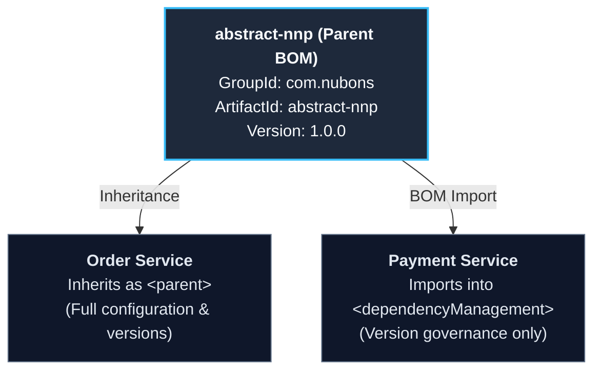

# User Manual and Deployment Guide

This document provides technical instructions for developers, architects, and DevOps engineers on consuming, configuring, building, and publishing the `abstract-nnp` parent POM and Bill of Materials (BOM).

---

## Table of Contents

1. [Overview](#1-overview)
2. [Prerequisites](#2-prerequisites)
3. [Downstream Consumption](#3-downstream-consumption)
   - [Method 1: Parent POM Inheritance (Recommended)](#method-1-parent-pom-inheritance-recommended)
   - [Method 2: BOM Import via Dependency Management](#method-2-bom-import-via-dependency-management)
   - [Overriding Managed Versions](#overriding-managed-versions)
   - [Verifying Dependency Resolution](#verifying-dependency-resolution)
4. [Maven Configuration and Authentication](#4-maven-configuration-and-authentication)
   - [Configuring settings.xml](#configuring-settingsxml)
   - [GitHub Packages Authentication](#github-packages-authentication)
   - [GitLab Maven Registry Authentication](#gitlab-maven-registry-authentication)
   - [Maven Central (Sonatype OSSRH) Authentication](#maven-central-sonatype-ossrh-authentication)
5. [Local Build and Installation](#5-local-build-and-installation)
6. [Deployment and Release Guidelines](#6-deployment-and-release-guidelines)
   - [Release Versioning Strategy](#release-versioning-strategy)
   - [Automated Deployment with GitHub Actions](#automated-deployment-with-github-actions)
   - [Automated Deployment with GitLab CI/CD](#automated-deployment-with-gitlab-cicd)
   - [Manual Release via CLI](#manual-release-via-cli)
7. [Troubleshooting and Frequently Asked Questions](#7-troubleshooting-and-frequently-asked-questions)

---

## 1. Overview

`abstract-nnp` serves as the centralized foundation and governance artifact for Java 21 and Spring Boot 3.5+ microservices across the ecosystem. It provides:

- **Ecosystem Consistency**: Standardizes Spring Boot 3.5.x, Spring Cloud 2025.x, and Apache Camel 4.12.x versions.
- **Pre-validated Compatibility**: Ensures database drivers, JSON parsers, JWT utilities, and OpenAPI engines operate seamlessly without version drift or classpath conflicts.
- **Standardized Builds**: Centralizes compiler settings (Java 21 target/source/release), source JAR generation, and Javadoc automation.



---

## 2. Prerequisites

Before using or deploying `abstract-nnp`, ensure the following tools are installed:

| Requirement | Minimum Version | Recommended Version | Verification Command |
| :--- | :--- | :--- | :--- |
| **Java Development Kit (JDK)** | 21 (LTS) | OpenJDK 21.0.2+ / Eclipse Temurin 21 | `java -version` |
| **Apache Maven** | 3.9.0 | 3.9.6+ | `mvn -version` |
| **Git** | 2.30+ | Latest stable | `git --version` |
| **GnuPG (GPG)** *(For Central releases)* | 2.2+ | 2.4+ | `gpg --version` |

---

## 3. Downstream Consumption

Downstream services can integrate `abstract-nnp` using either **Parent Inheritance** or **BOM Import**.

### Method 1: Parent POM Inheritance (Recommended)

Inherit all dependency management, compiler plugin settings, and default repository configurations:

```xml
<project xmlns="http://maven.apache.org/POM/4.0.0"
         xmlns:xsi="http://www.w3.org/2001/XMLSchema-instance"
         xsi:schemaLocation="http://maven.apache.org/POM/4.0.0 https://maven.apache.org/xsd/maven-4.0.0.xsd">
    <modelVersion>4.0.0</modelVersion>

    <parent>
        <groupId>com.nubons</groupId>
        <artifactId>abstract-nnp</artifactId>
        <version>1.0.0</version>
        <relativePath/> <!-- Look up from repository -->
    </parent>

    <groupId>com.example</groupId>
    <artifactId>my-microservice</artifactId>
    <version>0.0.1-SNAPSHOT</version>

    <dependencies>
        <!-- Spring Boot Web Starter (version inherited from Spring Boot parent) -->
        <dependency>
            <groupId>org.springframework.boot</groupId>
            <artifactId>spring-boot-starter-web</artifactId>
        </dependency>

        <!-- PostgreSQL Driver (version managed by abstract-nnp) -->
        <dependency>
            <groupId>org.postgresql</groupId>
            <artifactId>postgresql</artifactId>
        </dependency>

        <!-- SpringDoc OpenAPI (version managed by abstract-nnp) -->
        <dependency>
            <groupId>org.springdoc</groupId>
            <artifactId>springdoc-openapi-starter-webmvc-ui</artifactId>
        </dependency>

        <!-- Apache Commons Lang3 (version managed by abstract-nnp) -->
        <dependency>
            <groupId>org.apache.commons</groupId>
            <artifactId>commons-lang3</artifactId>
        </dependency>
    </dependencies>
</project>
```

> **Note**: `<version>` tags are omitted for managed dependencies. The exact validated version is resolved automatically by `abstract-nnp`.

---

### Method 2: BOM Import via Dependency Management

If a project already requires a distinct enterprise parent POM, import `abstract-nnp` as a Bill of Materials (BOM):

```xml
<dependencyManagement>
    <dependencies>
        <dependency>
            <groupId>com.nubons</groupId>
            <artifactId>abstract-nnp</artifactId>
            <version>1.0.0</version>
            <type>pom</type>
            <scope>import</scope>
        </dependency>
    </dependencies>
</dependencyManagement>
```

---

### Overriding Managed Versions

To override a specific version defined in `abstract-nnp`, override the corresponding property in your child `pom.xml`:

```xml
<properties>
    <!-- Example: Override PostgreSQL driver version -->
    <postgresql.version>42.7.8</postgresql.version>
</properties>
```

Alternatively, explicitly define the `<version>` inside your child dependency declaration.

---

### Verifying Dependency Resolution

To inspect resolved versions and verify classpath integrity:

```bash
# Display the effective POM
mvn help:effective-pom

# Display the dependency tree
mvn dependency:tree

# Filter the dependency tree for a specific library
mvn dependency:tree -Dincludes=org.postgresql:postgresql
```

---

## 4. Maven Configuration and Authentication

To resolve `abstract-nnp` from or publish artifacts to remote registries, configure `~/.m2/settings.xml`.

### Configuring settings.xml

A reference configuration template is provided in [.m2/settings.xml](.m2/settings.xml). Copy or merge it with your user settings:

- **Linux / macOS**: `~/.m2/settings.xml`
- **Windows**: `%USERPROFILE%\.m2\settings.xml`

### GitHub Packages Authentication

Generate a GitHub Personal Access Token with `read:packages` and `write:packages` permissions.

In your `settings.xml`:

```xml
<servers>
    <server>
        <id>github</id>
        <username>YOUR_GITHUB_USERNAME</username>
        <password>YOUR_GITHUB_PERSONAL_ACCESS_TOKEN</password>
    </server>
</servers>
```

Add the repository configuration:

```xml
<profiles>
    <profile>
        <id>github-packages</id>
        <repositories>
            <repository>
                <id>github</id>
                <name>GitHub Packages</name>
                <url>https://maven.pkg.github.com/nubons/PICC-PC-Abstract-NNP-Platform</url>
                <snapshots><enabled>true</enabled></snapshots>
                <releases><enabled>true</enabled></releases>
            </repository>
        </repositories>
    </profile>
</profiles>
<activeProfiles>
    <activeProfile>github-packages</activeProfile>
</activeProfiles>
```

### GitLab Maven Registry Authentication

```xml
<servers>
    <server>
        <id>gitlab-maven</id>
        <username>gitlab-ci-token</username>
        <password>${env.GITLAB_AUTH_TOKEN}</password>
    </server>
</servers>
```

### Maven Central (Sonatype OSSRH) Authentication

```xml
<servers>
    <server>
        <id>ossrh</id>
        <username>${env.OSSRH_USERNAME}</username>
        <password>${env.OSSRH_PASSWORD}</password>
    </server>
</servers>
```

---

## 5. Local Build and Installation

To build and install `abstract-nnp` into your local `.m2` repository:

```bash
# Clone the repository
git clone https://github.com/nubons/PICC-PC-Abstract-NNP-Platform.git
cd PICC-PC-Abstract-NNP-Platform

# Validate POM syntax
mvn validate

# Install POM into local ~/.m2 repository
mvn clean install
```

---

## 6. Deployment and Release Guidelines

### Release Versioning Strategy

This project adheres to [Semantic Versioning 2.0.0](https://semver.org/):

- **`MAJOR.y.z`**: Breaking changes (e.g., major Spring Boot / Java baseline upgrades, removed dependencies).
- **`x.MINOR.z`**: Backwards-compatible feature additions or new managed dependencies.
- **`x.y.PATCH`**: Bug fixes, security CVE patches, or minor dependency version bumps.

---

### Automated Deployment with GitHub Actions

The repository includes a configured workflow in `.github/workflows/ci-cd.yml` that validates pull requests and publishes releases on tag creation:

```yaml
name: Build & Publish CI/CD

on:
  push:
    branches: [ main, develop ]
    tags: [ 'v*.*.*' ]
  pull_request:
    branches: [ main ]

jobs:
  validate:
    runs-on: ubuntu-latest
    steps:
      - uses: actions/checkout@v4
      - uses: actions/setup-java@v4
        with:
          java-version: '21'
          distribution: 'temurin'
          cache: maven
      - run: mvn validate
      - run: mvn help:effective-pom
```

---

### Automated Deployment with GitLab CI/CD

```yaml
stages:
  - deploy

deploy-package:
  stage: deploy
  image: maven:3.9.6-eclipse-temurin-21
  script:
    - mvn clean deploy -Pgitlab-maven -s .m2/settings.xml -DskipTests
  only:
    - main
    - tags
```

---

### Manual Release via CLI

#### To GitHub Packages:
```bash
mvn clean deploy -Pgithub-packages -DskipTests
```

#### To Maven Central (OSSRH):
```bash
mvn clean deploy -Possrh -DskipTests
```

---

## 7. Troubleshooting and Frequently Asked Questions

### Q1: Maven cannot resolve `com.nubons:abstract-nnp:1.0.0`
**Resolution**:
1. Verify package publication in the target remote registry.
2. Ensure `~/.m2/settings.xml` has the active profile pointing to the package repository URL.
3. For local development, run `mvn clean install` within the `PICC-PC-Abstract-NNP-Platform` repository first.

### Q2: Java version mismatch or compilation failure
**Resolution**:
`abstract-nnp` requires **Java 21**. Verify that your environment uses JDK 21 via `java -version` and that `JAVA_HOME` is set accordingly.

### Q3: Excluding an unwanted transitive dependency
**Resolution**:
In your child service `pom.xml`, use standard Maven exclusions:

```xml
<dependency>
    <groupId>org.apache.camel.springboot</groupId>
    <artifactId>camel-spring-boot-starter</artifactId>
    <exclusions>
        <exclusion>
            <groupId>org.springframework.boot</groupId>
            <artifactId>spring-boot-starter-logging</artifactId>
        </exclusion>
    </exclusions>
</dependency>
```

---

*For contribution guidelines, refer to [DEVELOPMENT_GUIDELINES.md](DEVELOPMENT_GUIDELINES.md).*
